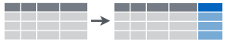
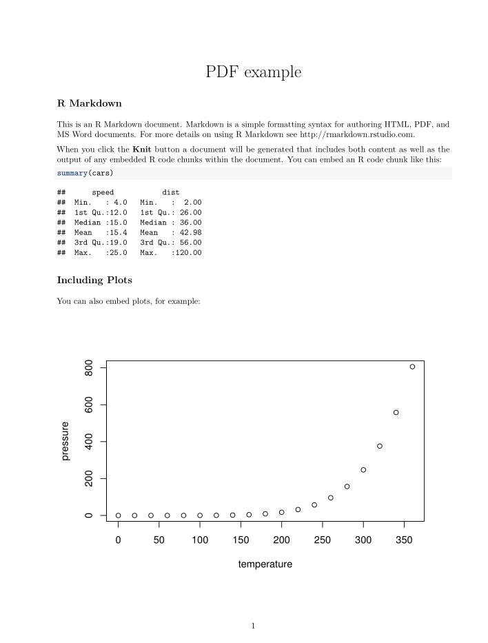
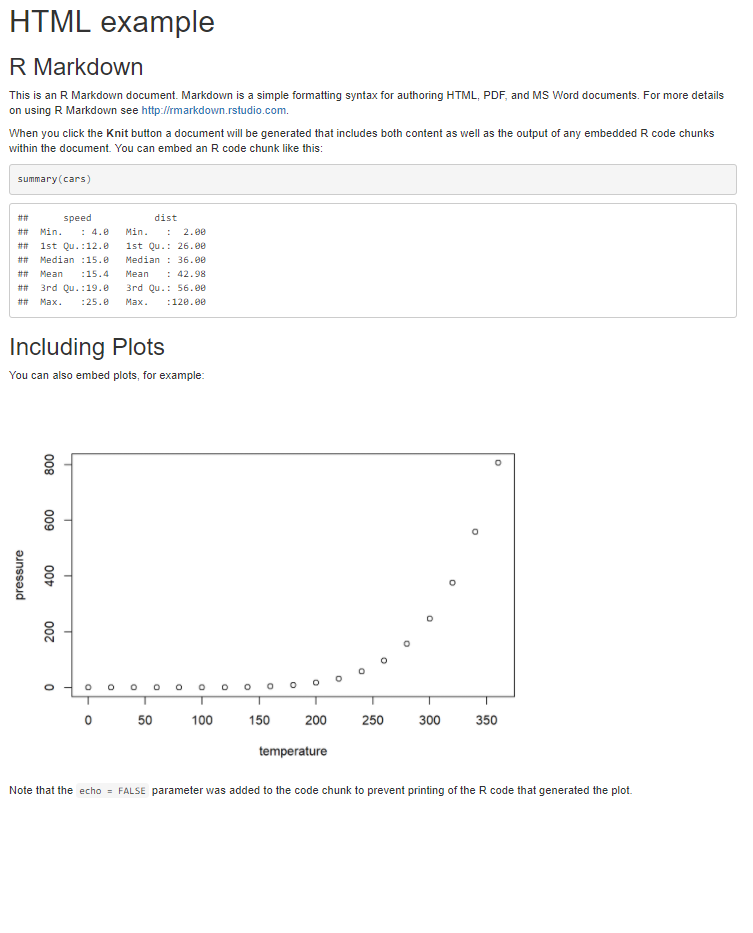
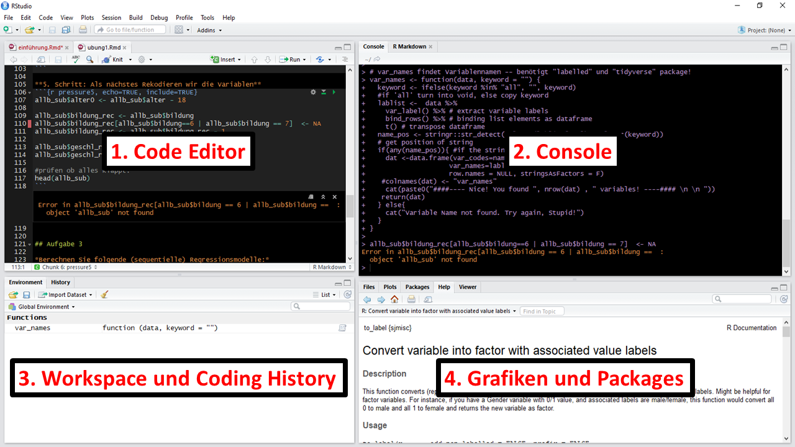
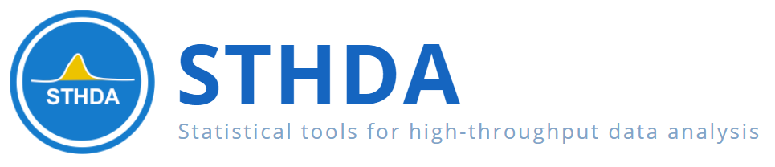

```{r presetup, include=FALSE}
library(learnr)
knitr::opts_chunk$set(echo = T, warning = F, error = F, message = F)
options(scipen = 999)
```

```{r setup, eval = T, echo = F}
library(learnr)
library(tidyverse)
set.seed(2017)

namen <- c("Trisha","Rabia","Halma","Franziska","Margarita",
          "Franz","Eugen","Rodriguez","Jan","Volker")
geschl <- c("weiblich","weiblich","weiblich","weiblich","weiblich",
            "männlich","männlich","männlich","männlich","männlich")
wahl <- c("SPD","Bündnis 90/Die Grünen","CDU/CSU","CDU/CSU","Die Linke",
            "AfD","SPD","SPD","CDU/CSU","Bündnis 90/Die Grünen")

einkommen <- rnorm(10,2700,1400)

dat<-data.frame(namen,einkommen,geschl,wahl)

vektor <- c(1,2,3,4,5) #definiere Vektor mit den Werten 1,2,3,4 und 5

```


## Start

{width="99%"}
<br>

R ist eine Open-Source-Programmiersprache welche speziell für statistische Berechnungen und Visualisierung von Daten und Modellen entwickelt wurde. 

> We believe free and open source data analysis software is a foundation for innovative and important work in science, education, and industry [(RStudio Homepage)](https://www.rstudio.com/).

Für die erleichterte Anwendung von R werden wir das IDE (Integrated Development Environment) namens Rstudio benutzen. Mit Rstudio wird R viel intuitiver durch Syntax Highlighting, Auto-Vervollständigung und einer besseren übersicht über Grafiken, Packages und Datensätze. Die Software ist komplett kostenlos und wird unter einer GPL (GNU General Public License) zugänglich gemacht.


### Installation

Um R benutzen zu können müssen wir erst die nötige Software auf unseren Computer installieren.

Unter folgendem Link kann R heruntergeladen werden

{width=50px}


[**DOWNLOAD R**](https://cloud.r-project.org/)


Unter folgendem Link kann Rstudio heruntergeladen werden

{width=100px}

[**DOWNLOAD RStudio**](https://www.rstudio.com/products/rstudio/download/)

__Latex zum Erstellen von .pdf Reports__

Unter folgenden Links kann die Latex Verteilung MiKTeX (Windows) bzw. MacTeX (Mac) heruntergeladen werden.

{width=100px}

[**DOWNLOAD MiKTeX (Windows)**](https://miktex.org/download)

{width=100px}

[**DOWNLOAD MacTeX (Mac)**](https://tug.org/mactex/mactex-download.html)


## Grundlagen

### R als Taschenrechner

* `+` addieren
* `-` subtrahieren
* `*` multiplizieren
* `/` dividieren
* `^` exponieren

**Rechenaufgaben:**

1. $1+1$
2. $\frac{500}{125} + 3*6^2$
3. Berechne die Differenz zwischen 2017 und dem Jahr, an dem du begonnen hast zu studieren und dividiere das durch die Differenz zwischen 2017 und dem Jahr, in dem du geboren wurdest. Multipliziere dies mit 100, um den Prozentsatz deines Lebens zu erhalten, den du an die Uni verbracht hast.


```{r zzz, exercise=TRUE, exercise.eval=F}


```

```{r zzz-solution}
1 + 1 
500/125 + 3*6^2
(2017 - study)/(2017 - birth)*100 
#ersetze study durch dein Studienbeginnsjahr und birth durch dein Geburtsjahr
```


### Objekte und Zuweisung


In R kann man je nach Rechenleistung zehntausende Datensätze auf einmal laden und verarbeiten. Das wird möglich da jeder Datensatz seinen eigenen Namen besitzt. Dieser muss mit einem Buchstaben beginnen, kann aber durchaus auch `.` oder `_` oder Zahlen enthalten. Um einem Objekt einen Namen zuzuweisen wird das Zeichen `<-` (Zuweisungspfeil) eingesetzt. Objekte können einzelne Zahlen, Variablen oder auch Datensätze sein. Mit den Objektennamen können Daten jeglicher Art abgespeichert und abgerufen werden. 

**Aufgabe:** 

Adddiere `x` und `y` und speichere das Ergebnis in z. Gebe z aus!

```{r obj, exercise=TRUE, exercise.eval=F}
x <- 1   #definiere x als 1
y <- 2   #definiere y als 2


```


```{r obj-solution}
z <- x + y    #addiere x und y und speicher das Ergebnis in z
z             #geb das Ergebnis aus

```

**Weitere Operatoren**

- `==` (logisch) ist gleich
- `!=` (logisch) ist ungleich
- `%in%` (string) ist gleich
- `>` größer als
- `<` kleiner als
- `>=` größer gleich
- `<=` kleiner gleich
- `is.na()` ist gleich NA (fehlender Wert)
- `!is.na()` ist ungleich NA 

**Boolean**

- `&` (logisch) und
- `|` (logisch) oder
- `xor(x, y)` x oder y
- `any()` Trifft mindestens einer der Werte zu?
- `all()` Treffen alle Werte zu?

{width="80%"}

**Beispiele**

```{r com, exercise = T, exercise.eval=F}
3 == 3    #ist 3 gleich 3?
4 > 5     #ist 4 größer als 5?
"albert" == "albert"   #kommt albert in albert vor?


```


R gibt hier entweder `TRUE` oder `FALSE` aus, abhängig davon ob der benutzte logische Operator zutrifft oder nicht.

### Vektoren

Vektoren in R sind einfach mehrere Werte die aneinander gebunden werden. Diese können Zahlen aber auch strings (Buchstabenfolgen) sein. Hiflreich dabei ist die `c()` Funktion (c steht für *concatenate* = verketten auf Deutsch).

**Beispiele:**


```{r vec, exercise=TRUE, exercise.eval=F}
vektor <- c(1,2,3,4,5) #definiere Vektor mit den Werten 1,2,3,4 und 5
vektor


```

Operatoren können auch ganz einfach mit Vektoren angewandt werden.

```{r vec2, exercise = T, exercise.eval=F}
vektor * vektor     #vektor mit sich selbst mal nehmen
vektor == vektor    #sind alle Werte von vektor gleich alle Werte von vektor?
```


### Funktionen

Das Ziel einer Funktion ist es Daten zu verarbeiten. Dazu gibt es einen *input* und einen *output*. 

Definieren wir doch mal eine Funktion, welche Werte die man als *input* eingibt wieder quadriert als *output* gibt. Dazu benutzen wir `function()` und bestimmen dabei die Argumente welche wir jeweils eintippen wollen. Die Funktion selber wird in geschweiften Klammern `{}` codiert.

**Beispiele:**

```{r function1, eval=T, exercise = T, exercise.eval=F}
quadrieren <- function(input) { 
  output <- input^2        #nehme den input hoch 2 und speichere ihn in output
  output                   #gebe output aus
}

#Funktion ausprobieren!
quadrieren(2)              
```

Wir können auch zwei oder mehrere Argumente zu einer Funktion hinzufügen. Probieren wir das gleiche doch mal mit einer Funktion die jeder aus dem Physik - Unterricht kennen sollte:
$$Distanz = \frac{Geschwindigkeit}{Zeit} \widehat{=} s = \frac{v}{t}$$

```{r function2, exercise = T, exercise.eval=F}
distanz <- function(v, t) {
 s <- v / t       #teile v / t und definiere deren Ergebnis als s
 s                #gebe s aus
}

#Funktion ausprobieren!
distanz(50,6)
```

Nun müssen wir allerdings nicht immer selber Funktionen definieren. Im Gegenteil! `Base R` und die vielen Packages haben unzählige Funktionen, die Datenbearbeitung einfach machen. Beispielsweise gibt `mean()` den Mittelwert eines Vektors aus und `sd()` gibt die Standardabweichung.

```{r func1, exercise = T, exercise.eval=F}
mean(vektor)   #gib den Mittelwert von vektor aus
sd(vektor)     #gib die Standardabweichung von vektor aus
```

### Wie bekommt man Hilfe?

Starthilfe: `help.start()`

Technische Dokumentation für die meisten Funktionen: `help(name)` oder den Cursor über den Funktionsnamen ausrichten und F1 drücken.
Nutze ? um Hilfe für Funktionen zu bekommen. 

*Beispiel:* `?mean`

**Die beste Hilfe**

 


Google weiß einfach alles. 

 


Eine weitere gute Möglichkeit ist [Stackoverflow](https://stackoverflow.com/) für alle Fragen rund ums Programmieren. Dort findet man viele verschiedene Software-Packages und alle Details zu Theorie und Anwendung.


## Datenimport und -export

Für den Datenimport muss als erstes der Ordnerpfad für das *working directory* festgelegt werden. Das geht am besten durch einen Rechtsklick auf **Datensatz -> Ordnerpfad**. Bei Windows müssen die Slashes von `\` zu `/` geändert werden.

```{r, eval=F}
#speichere Pfad in path_data
path_data <- "C:/Users/Fabio/Dropbox/9. Semester Master/Tutorium"
#setwd() setzt den working directory zu path_data
setwd(path_data) 
#getwd() zeigt an wo das jetzige working directory sich befindet
getwd()          
```


**Rdata**

Ist das R-native Datenformat.

```{r, eval=F}
#Import
dat <- get(load("file_name.Rdata"))  #lade Datensatz und weise ihn dat zu
#Export
save(dat, file = "file_name.Rdata")  #speichere Datensatz
```


**SPSS**

Das package `haven` erlaubt es Datensätze zwischen den gängigsten Statistik-Programmen zu transportieren.

```{r, eval=F}
# install.packages("haven")        #installiere package "haven"
library(haven)                     #lade package haven

#Import
dat <- read_sav("file_name.sav")   #lade Datensatz und weise ihn dat zu
#Export
write_sav(dat, "file_name.sav")    #speichere Datensatz
```


**CSV**

Wenn ein Excel-Datensatz (.xlsx) vorliegt kann dieser einfach in csv (comma sperated values) abgespeichert werden.

```{r, eval=F}
#Import
dat <- read.csv(file_name = "file.csv",  #lade Datensatz und weise ihn dat zu
               header = T, 
               sep = ",", 
               dec = ".", 
               stringsAsFactors = F)
#Export
write.csv(dat, file = "file_name.csv", row.names = F) #speichere Datensatz
```

**Stata**

```{r, eval=F}
# install.packages("haven")         #installiere package "haven"
library(haven)                      #lade package haven

#Import
dat <- read_dta("file_name.dta")  #lade Datensatz und weise ihn dat zu
#Export
write_dta(dat, "file_name.dta")   #speichere Datensatz
```

**SAS**

```{r, eval = F}
# install.packages("haven")          #installiere package "haven"
library(haven)                       #lade package haven

#Import
dat <- read_sas("file_name.sas7bdat")  #lade Datensatz und weise ihn dat zu
#Export
write_sas(d, "file_name.sas7bdat")     #speichere Datensatz
```


## Dataframes und Base R 

Zunächst einmal eine kleine Übersicht:

**Es gibt drei Variablen-Haupttypen**

- **Factor :** Unveränderliche Ausprägungen (z.B. Gender, Religion).
- **Character :** aka "String" oder 'String', veränderbarer Text.
- **Numeric :** Jeglicher Zahleninput mit dem man rechnen kann.

Tranformation zwischen den Datentypen

`as.factor()`

`as.character()`

`as.numeric()`

Vektoren können wir auch zu Datensätzen zusammenfügen. Wie? 

Ganz einfach mit der Funktion `data.frame`!

Lasst uns mal einen Beispieldatensatz erstellen.

```{r datstellen, exercise = T, exercise.eval=F}
namen <- c("Trisha","Rabia","Halma","Franziska","Margarita",
          "Franz","Eugen","Rodriguez","Jan","Volker")

geschl <- c("weiblich","weiblich","weiblich","weiblich","weiblich",
            "männlich","männlich","männlich","männlich","männlich")

wahl <- c("SPD","Bündnis 90/Die Grünen","CDU/CSU","CDU/CSU","Die Linke",
            "AfD","SPD","SPD","CDU/CSU","Bündnis 90/Die Grünen")

#ein Seed garantiert dass immer die selben Zahlen gezogen werden
set.seed(2010) 
#Ziehe 10 Werte aus Normalverteilung mit Mittelwert 2700 und Standardabweichung 1400
einkommen <- rnorm(10,2700,1400) 

#füge alles zu einem data.frame zusammen
dat<-data.frame(namen,einkommen,geschl,wahl) 
#zeige den dataframe
dat 
```


Möglicherweise habt ihr bemerkt, dass R Buchstabenabkürzungen unter den Spaltennamen des Datensatzes `dat` anzeigt. Diese Abkürzungen beschreiben den Typ der Variablen, die in jeder Spalte gespeichert sind:

* `int` steht für ganze Zahlen (integers).

* `dbl` steht für Doubles oder reelle Zahlen.

* `chr` steht für Zeichenvektoren oder Zeichenfolgen.

* `dttm` steht für Datumsangaben (ein Datum + eine Uhrzeit).

Es gibt drei andere gängige Variablentypen, die nicht in diesem Datensatz vorkommen:

* `lgl` steht für logische Vektoren, die nur` TRUE` oder `FALSE` enthalten.

* `fctr` steht für Faktoren, die R verwendet, um kategoriale Variablen darzustellen.

* `date` steht für Zeitdaten.

Diese Reihe von Variablentypen ist einzigartig für tibbles und ist eine der Möglichkeiten, wie tibbles benutzerfreundlicher als Datenrahmen zu sein versuchen.

**Weitere Typen**

- **Boolean** <>: [TRUE | FALSE], [T | F]
- **NA:** Missing Values
- **NaN** <>: 0/0 'Not a Number'
- **Infinity** <+/- Inf>: 1/0

Sehr Angenehm kann man auf einzelne Variablen mit Hilfe des Dollarzeichens in der Form `data$variable` zugegriffen werden.

```{r dat, exercise = T, exercise.eval=F}
dat$einkommen   #zeige einkommen, welches sich im Datensatz dat befindet
dat$wahl        #zeige wahl, welches sich im Datensatz dat befindet


```


### Rekodieren

Datensätze sind aneinander gereihte Variablen der selben Länge. Mit Base kann ein Datensatz nach der Logik `data[Zeilen, Spalten]` oder `data[rows, columns]` angesteuert weden. 

Hier sind einige Datenabfragen und -manipulationsweisen:

```{r, echo=FALSE}
library(htmltools)
includeHTML("images/marker2.html")
```

```{r www, exercise = T}


```


**Lasst uns ein bisschen rekodieren!**

Nehmen wir an, dass wir die Einkommensvariable als eine dummy Variable (zwei Ausprägungen) benutzen wollen. Am besten geht das mit `ifelse()`. 

Die Funktion `ifelse()` testet eine logische Bedingung in ihrem ersten Argument. Wenn der Test `TRUE` ist, gibt `ifelse()` das zweite Argument zurück. Wenn der Test `FALSE` ist, gibt `ifelse()` das dritte Argument zurück.

Also in folgender Form: `ifelse(logischer Test, was passiert wenn zutrifft, was passiert wenn nicht zutrifft)`

**Beispiel:**

```{r ifelse, exercise = T, exercise.eval=F}
#character version
dat$eink_kat <- ifelse(dat$einkommen >= 3000, "hoch" ,"niedrig")
#numerische version
dat$eink_num <- ifelse(dat$einkommen >= 3000, 1 , 0)
dat
```

**Aufgabe**

Kodiere SPD (=1) und alle anderen Parteien (=0) und zeige den Datensatz!

```{r mlo, exercise=TRUE, exercise.eval=F}


```

```{r mlo-solution}
dat$spd <- ifelse(dat$wahl=="SPD", 1, 0)
dat
```

Die logische Operatoren `&`(und), `|` (oder) können zwei oder mehr Bedingungen miteinander verknüpfen. 

**Aufgabe**

Kodieren wir eine Variable mit 2 Bedingungen: die Variable **groko**, welche SPD und CDU/CSU (=1) und restliche Parteien (=0) angibt. 

```{r mlp, exercise=TRUE, exercise.eval=F}


```

```{r mlp-solution}
dat$groko <- ifelse(dat$wahl == "CDU/CSU" | dat$wahl == "SPD" ,1,0)
dat
```


Mit `ifelse()` lässt sich allerdings zunächst einmal nur zwei Werte auf einmal rekodieren (es besteht auch die Möglichkeit `ifelse()` Funktionen ineinander zu schachteln aber das machen wir erstmal nicht).


Wollen wir mehrere Werte einer Variable umkodieren, so könnnen wir folgende Methode aus `Base R` verwenden:

```{r recode, exercise=TRUE, exercise.eval=F}

dat$wahl_kat[dat$wahl == "CDU/CSU"] <- 1
dat$wahl_kat[dat$wahl == "SPD"] <- 2
dat$wahl_kat[dat$wahl == "Bündnis 90/Die Grünen"] <- 3
dat$wahl_kat[dat$wahl == "Die Linke"] <- 4
dat$wahl_kat[dat$wahl == "AfD"] <- 5

dat
```

## Das **`tidyverse`**

```{r, echo=F}
dat[,c("eink_kat", "eink_num", "spd", "wahl_kat")] <- NULL
```


{width="100%"}

Hier eine kleine übersicht von relevanten Funktionen, die wir brauchen werden:

```{r, echo=FALSE, fig.align='center'}
library(htmltools)
includeHTML("images/marker3.html")
```

Neben `Base R` gibt es allerdings nonch das `tidyverse`, dass viele mächtige Packages enthält! Das package kann mit der Funktion  `install.packages()` installiert und mit der Funktion `library()` in den Arbeitspeicher geladen werden.

```{r, echo=T, eval=F}
install.packages("tidyverse")  #installiere package "tidyverse"
library(tidyverse)             #lade package tidyverse
```

Jetzt können wir auf die mächtigen Funktionen des `tidyverse` zugreifen!

### Spalten auswählen mit `select()`

{width=200px}

Mit `select` werden Spalten (=Vektoren/Variablen) mittels dem Variablennamen oder einer Hilfsfunktion ausgewählt. 

Wählen wir wieder nur die vier folgenden Variables aus: 

- `namen`
- `einkommen` 
- `wahl`


```{r sel, exercise=TRUE, exercise.eval=F}
select(dat, namen, einkommen, wahl)
```

**Aufgabe**

Wähle die folgende Variablen aus!

- `geschl` 
- `wahl`
- `einkommen`

```{r ddd, exercise=TRUE, exercise.eval=T}


```

```{r ddd-solution}
select(dat, geschl, wahl, einkommen)
```


### Neue Variablen erstellen mit `mutate()`

{width=200px}
{width=200px}


Mit `mutate()` wird/werden eine oder mehrere neue Variable(n) erzeugt und an den Datensatz hinten angefügt. Wir können beispielsweise Einkommen in 1000 Euro Schritte transformieren.

```{r mut, exercise=TRUE, exercise.eval=F}
mutate(dat, eink1000 = einkommen / 1000)
```

**Aufgabe**

Generiere eine neue Variable mit dem Namen `einkommen_z`, welche das Einkommen z-standartisiert mit Hilfe der Funktion `scale()`.

```{r abc, exercise=TRUE, exercise.eval=F}


```

```{r abc-solution}
mutate(dat, einkommen_z = scale(einkommen))

```

Eine sehr hilfreiche Funktion für das rekodieren von Variablen ist `recode()`. 

**Hier ein Beispiel:**


```{r reec1, exercise=TRUE, exercise.eval=F}
recode(dat$wahl, 
       "SPD" = 1, 
       "CDU/CSU" = 2,
       "Bündnis 90/Die Grünen" = 3,
       "Die Linke" = 4,
       "AfD" = 5)
#Nicht vergessen: Faktoren und Charakter Variablen in "  " setzen!
```

`mutate()` und `recode()` können auch einfach in einer Funktion gemeinsam eingesetzt werden um gleich einen Datensatz mit der neu erstellten Variable auszugeben.

**Beispiel:**

```{r reec2, exercise=TRUE, exercise.eval=F}
mutate(dat, 
 wahl_num = recode(wahl, 
       "SPD" = 1, 
       "CDU/CSU" = 2,
       "Bündnis 90/Die Grünen" = 3,
       "Die Linke" = 4,
       "AfD" = 5))
```


### Zeilen auswählen mit `filter()`

{width=200px}

Mit `filter()` behält man oder selektiert man Zeilen eines Datensatzes, welche bestimmte logische Kriterien oder Konditionen erfüllen. Damit wird ein Subset (Untergruppe) gebildet. Wir wählen jetzt nur die Fälle aus, welche unser Kriterium erfüllen.

```{r filt, exercise=TRUE, exercise.eval=F}
filter(dat, wahl == "CDU/CSU")
```

**Aufgabe**

Filtere den Datensatz und zeige die Fälle die weniger als 2700 Euro verdienen.


```{r bbb, exercise=TRUE, exercise.eval=F}


```

```{r bbb-solution}
filter(dat, einkommen < 2700)
```


### Variablen umbennen mit `rename()`

Mit `rename()` lassen sich die Variablen umbennen. Beispielhaft übersetzen wir die Variablennamen ins Englische.

**Beispiel:**

```{r ren, exercise=TRUE, exercise.eval=F}
rename(dat,
    names = namen,
    income = einkommen,
    sex = geschl,
    vote = wahl
    )
```


### Der sexy pipe operator `%>%`


Mit der Hilfe von `%>%` können alle diese Operationen auf einmal ausgeführt werden!

[Prozent größer Prozent] wird pipe operator genannt. Diese Pipe ermöglicht es Daten einfacher, verständlicher und lesbarer und ohne Verlust von Flexibilität zu transformieren.
Den pipe operator kann man sich als "danach" vorstellen. 

**Hier ein Beispiel:**

```{r piped, exercise=TRUE, exercise.eval=F}
dat %>% 
  select(namen, einkommen, wahl) %>%
  mutate(eink1000 = einkommen / 1000) %>%
  filter(wahl == "CDU/CSU") %>%
  rename(names = namen,
    income = einkommen,
    vote = wahl,
    inc1000 = eink1000)
```

## Visualisierung und Modellierung

### Data Preperation

```{r}
load(url('https://github.com/systats/macro_project/raw/master/project_macro.Rdata'))
# filter data
dat <- project_macro %>% 
  #filter(year == 2000) %>%
  select(
    iso2c,
    country,
    year,
    exports,
    life_exp,
    gdp_ppp,
    free_polity
  ) %>%
  arrange(country, year)
```


### Data Visualization

```{r, echo=FALSE, message=F, warning=F}
selectInput("var", label = "Time Series", choices = c("exports", "free_polity", "life_exp", "gdppc"))
library(highcharter)
highcharter::highchartOutput("plot")
```

```{r, context="server"}
load(url('https://github.com/systats/macro_project/raw/master/project_macro.Rdata'))
# filter data
vdem <- project_macro

library(highcharter)

output$plot <- highcharter::renderHighchart({
  gg1 <- vdem %>%
  filter(iso2c %in% c("BR", "SA", "DE", "CN", "US")) %>%
    arrange(country, year) %>%
    select(country, year, input$var)
  colnames(gg1)[length(gg1)] <- "y"

  hchart(gg1, "line", hcaes(x = year, y = y, group =  country)) %>% hc_add_theme(hc_theme_google())

  # ggplot(aes_string(x = "year", y = input$var, colour = "country")) 
})
```

### Lineare Regression


$$y_i = \beta_0 + \beta_1 x_{1i} + \varepsilon_i$$

Führen wir doch einmal eine lineare Regression aus mit der abhängigen Variable `free_polity` (Freedom House/Polity IV) und den unabhängigen Variablen `exports` (Export Value in Dollar), `life_exp` (Lebenserwartung) und `gdp_ppp` (GDP per capita PPP)

```{r,echo=F}
load(url('https://github.com/systats/macro_project/raw/master/project_macro.Rdata'))
# filter data
vdem <- project_macro
```


```{r, results="markup"}
fit1 <- lm(free_polity ~ exports + life_exp + gdp_ppp, data=vdem)

summary(fit1)
```

Zur besseren Darstellung können wir auch das package `texreg` und die Funktion `screenreg` benutzen.


```{r}
#install.packages("texreg")
library(texreg)
screenreg(fit1)
```

Da wir uns in einem HTML befinden können wir auch `htmlreg()` benutzen (das Latex equivalent für pdf Dateien wäre `texreg()`)

```{r, results="asis"}
htmlreg(fit1)
```

Zum visualisieren von Modellen jeglicher Art bietet sich das Package `sjPlot` und die mächtige `plot_model` Funktion an.

**ONE FUNCTION TO RULE THEM ALL**

```{r}
#install.packages("sjPlot")
library(sjPlot)
plot_model(fit1, type = "std", #macht dass die Koeffizienten standartisiert werden
           show.values = T)  #zeigt die Koeffizienten Werte und deren Signikikanz

```

Wir können uns auch die Regressionsgeraden anzeigen lassen:

```{r}
plot_model(fit1, type = "slope", #zeigt Regressionsline und Loess-Kurve
           show.data = T) #zeigt Datenpunkte
```

Die `plot_model()` Funktion kann noch viel viel **viel** mehr! Belassen wir es aber erst einmal hierbei. Wenn ihr neuigierig seid, schaut euch doch einfach mal diesen Blogpost vom package creator an:

[Strenge Jacke Blog - plot_model() Funktion](https://strengejacke.wordpress.com/2017/10/23/one-function-to-rule-them-all-visualization-of-regression-models-in-rstats-w-sjplot/)

## R-Markdown

<center></center>

Um ein Summary, Exzerpt oder Abstract zu schreiben und dabei die Möglichkeit zu haben sowohl Grafiken, Tabellen, Links als auch eigene Statistiken direkt mit einzubinden ist die Anwendung von `R Markdown` optimal. R Markdown ist eine Variante von [Markdown](http://kbroman.org/knitr_knutshell/pages/markdown.html) und ist wichtig für eine robuste und nachvollziebare Dokumentation wenn man Daten arbeitet. `R Markdown` wurde mit den Grundgedanken konzipiert, so einfach lesbar und schreibbar wie möglich zu sein.


`R Markdown` umfasst `R Code Chunks` und wird in Verbindung mit `knitr` verwendet um ganz einfach **tolle, reproducible, web-basierte Reports** zu erstellen. `knitr`ist ein `R package` welches den Zweck hat R-Code in `LaTex`Dokumente einzubinden. Hier spart man sich also das "copy-paste" und generiert reproducible research. Wenn ein Dokument `knit`wird, sendet R Markdown ein `.Rmd` - Dokument an `knitr`, was wiederrum alle `R Code Chunks` ausführt und ein neues Markdown `.md` - Dokument (inklusiv Code und Output) erstellt. Anschließend wird das generierte Dokument mit Hilfe von `pandoc`, http://pandoc.org/, zum finalen Output abgewickelt. 

[mehr Infos zu `knitr`](https://yihui.name/knitr/)  
  
<center></center>  


Folgende Output Formate werden momentan unterstützt:

```{r, eval = F, echo = T}
---
title: "PDF example"
output: pdf_document
---
```



```{r, eval = F, echo = T}
---
title: "HTML example"
output: html_document
---
```



```{r, eval = F, echo = T}
---
title: "Word example"
output: word_document
---
```


### Chunk Options:

Folgende Chunk Options können eingestellt werden:

| option     | default | effect                                                    |
|------------|---------|-----------------------------------------------------------|
| eval       | TRUE    | Whether to evaluate the code and include its results      |
| echo       | TRUE    | Whether to display code along with its results            |
| warning    | TRUE    | Whether to display warnings                               |
| error      | FALSE   |  Whether to display errors                                |
| message    | TRUE    | Whether to display messages                               |
| tidy       | FALSE   | Whether to reformat code in a tidy way when displaying it |
| results    | markup  | "markup", "asis", "hold", or "hide"                       |
| cache      | FALSE   | Whether to cache results for future renders               |
| comment    | ##      | Comment character to preface results with                 |
| fig.width  | 7       | Width in inches for plots created in chunk                |
| fig.height | 7       | Height in inches for plots created in chunk               |


Hier ein Beispielchunk, welcher den Code anzeigt und ausführt:

    ```{r, echo=T, eval=T}`r ''`
    schrottcode <- 5 + 6
    ```

Auf folgendem Link findet ihr ein sehr übersichtliches *Cheat Sheet*
[R Markdown Cheat Sheet](http://shiny.rstudio.com/articles/rm-cheatsheet.html)

## Ansicht und Layout

Ändern wir einmal globale Optionen zur Ansicht und Layout.

Zunächst klicken wir unter dem Reiter **Tools** -> **Global Options**

{width="100%"}

Als nächstes können wir unter **Appearance** verschiedene Einfärbungen wählen, welche die Ansicht von Rstudio etwas angenehmer machen (können). 

Unter **Layout** können wir die folgende Anordnung der verschiedenen Panels benutzen, die generell etwas komfortabler ist.

{width="100%"}


Schauen wir uns jetzt einmal die vier Panels von Rsudio an:

Das Interface von Rstudio besteht aus vier Fenstern für 1) Erstellen einer Datei mit R-Skript, 2) Eingeben von R-Befehlen, 3) Anzeigen von Befehlsverläufen, 4) Anzeigen von Plots und mehr.

{width="100%"}


**Oben links:** 

Code-Editor, der das R-Skript enthält. Ein neues R-Skript kann wie folgt erstellt werden: **Datei -> Neu -> R-Skript**.

**Oben rechts:** 

R-Konsole zur Eingabe von R-Befehlen

**Unten links:**

- *Files:* Dateien im working directory anzeigen

- *Plots:* Zeigt die erstellten Grafiken an. Auf dieser Registerkarte kann man eine Grafik in eine PDF- oder eine Bilddatei exportieren

- *Packages:* Zeigt externe R-Pakete an, die auf Ihrem Systemverfügbar sind. Wenn - diese Option aktiviert ist, wird das Paket in R geladen.

- *Help:* Zeigt die Hilfe zu einer Funktion. (Aufrufbar mit `?<<funktionsname>>`) 

**Unten rechts:**

- *Environment:* Zeigt die Liste der R-Objekte an, die während der R-Sitzung erstellt wurden.

- *History*: Zeigt die History aller vorherigen Befehle an.


## Und jetzt?

**Joint der R-Group Stuttgart!**

| - | - |
|---|---|
| {width=150px}  | {width=150px} |
| [R-Group Stuttgart auf Facebook](https://www.facebook.com/groups/rstuttgart/) | [R-Group Stuttgart auf GitHub](https://r-group-stuttgart.github.io/) |

{width="100%"}


<br>


Wenn ihr noch Interesse habt selber ein bisschen Dinge in R auszuprobieren seien euch folgende Quellen empfohlen:

{width="85%"}


[http://www.sthda.com/english/](http://www.sthda.com/english/)

<br>


{width="50%"}


[https://www.r-bloggers.com/](https://www.r-bloggers.com/)


<br>


[Online Book Version](http://r4ds.had.co.nz/)