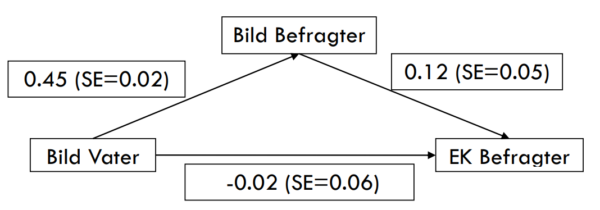

```{r chunks, include=FALSE}
# Default Options - kann bei Gebrauch geändert werden
knitr::opts_chunk$set(
  echo = T # Whether to display code along with its results
  , eval = T # Whether to evaluate the code and include its results
  , results = "asis" # this at deafult is in end much more efficient
  , cache = F # Whether to cache results for future renders (efficient!)
  , warning = F # Whether to display errors
  , message = F # Whether to display messages
  , error = F # maybe turn on
  , tidy = F # Whether to reformat code in a tidy way when displaying it
  , fig.width = 6 # plot width at 6
  , fig.height = 4 # plot height at 4
  , fig.align = "center" # plot alignment center
)

options(xtable.comment = FALSE, scipen = 9999)

```

```{r packages and functions, include=FALSE, echo=F}
#############
# NEU NEU NEU#
#############

# install.packages("pacman")
# pacman::p_install_gh("favstats/favstats")

pacman::p_load(tidyverse, haven, sjPlot, sjmisc, texreg, car, psych, knitr, labelled, broom, magrittr, BaylorEdPsych, lmtest)

# Hilfsfunktionen einladen
#source("functions.R")
```

____


## Aufgabe 1

*Berechnen Sie die Signifikanz (95%) für alle direkten und indirekten Effekte dieses Modells.*

$$t_{krit} = \frac{b}{SE_b}$$
$$t_{krit} < 1.96 = \alpha(0.05)$$
**Effekte bezeichnen**

```{r}
b_yx <- -0.02
se_yx <- 0.06
b_zx <- 0.45
se_zx <- 0.02
b_yz <- 0.12
se_yz <- 0.05
```

**Direkte Effekte**

```{r}

```

**Indirekte Effekte**

```{r}

```

**Signifikanz des indirekten Effekts nach Sobel**
 
$$SE_{b_{zx \cdot yz}} = \sqrt{b_{yz}^2 \times SE_{b_{zx}}^2 + b_{zx}^2 \times SE_{b_{yz}}^2}$$

```{r}

```


## Aufgabe 2

*Um welche Form von Mediatormodell handelt es sich wahrscheinlich? Können Sie sich bei dieser Aussage sicher sein?*


## Aufgabe 3

*Berechnen Sie den totalen Effekt von Bild Vater auf EK Befragter.*


```{r}

```


### Aufgabe 4

*Wie wäre die Signifikanz des totalen Effekts zu berechnen?* 


